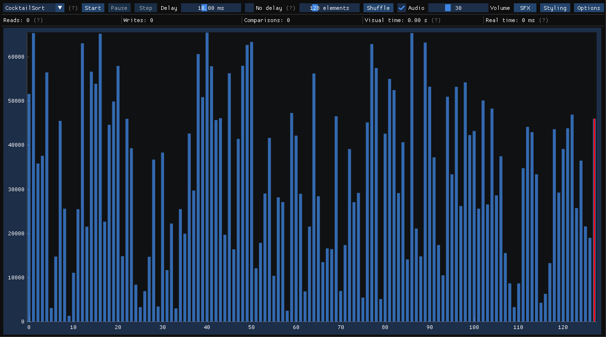
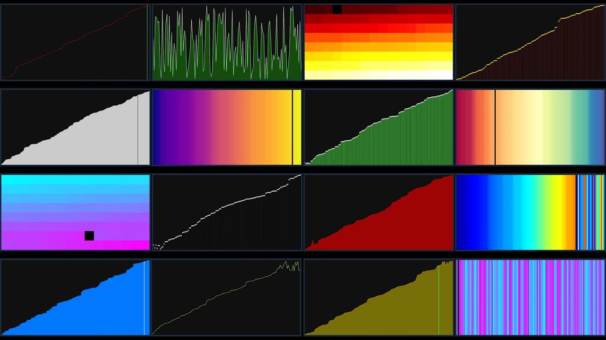

# StylishVisualizer
This is a program which visualizes a bunch of [sorting algorithms](https://en.wikipedia.org/wiki/Sorting_algorithm).  
Made in C++17 using [SFML](https://github.com/SFML/SFML) 2.6.1, [ImGui](https://github.com/ocornut/imgui) 1.88 (+[imgui-sfml](https://github.com/eliasdaler/imgui-sfml) 2.6) and [ImPlot](https://github.com/epezent/implot) 0.16, the code is completely cross platform (checkout the [releases](https://github.com/CosminPerRam/StylishVisualizer/releases) page)!  



See a video of the (pretty much latest) version ([v1.1.0](https://github.com/CosminPerRam/StylishVisualizer/releases/tag/1.1.0)) [here](https://www.youtube.com/watch?v=UJPxN8VMNUY).

Or do you want to see the older version ([v1.0.0](https://github.com/CosminPerRam/StylishVisualizer/releases/tag/1.0.0))? It's [here](https://www.youtube.com/watch?v=IISj6aj4E6o).

## Capabilities
Has the following sorting algorithms implemented out of the box (there are 15 of them):  
[Bubble Sort](https://en.wikipedia.org/wiki/Bubble_sort),
[Cocktail Sort](https://en.wikipedia.org/wiki/Cocktail_shaker_sort),
[Merge Sort](https://en.wikipedia.org/wiki/Merge_sort),
[Quick Sort](https://en.wikipedia.org/wiki/Quicksort),
[Radix Sort (Least And Most Significant Digit)](https://en.wikipedia.org/wiki/Radix_sort),
[Shell Sort](https://en.wikipedia.org/wiki/Shellsort),
[Stalin Sort](https://www.quora.com/What-is-Stalin-sort),
[Bogo Sort](https://en.wikipedia.org/wiki/Bogosort),
[Comb Sort](https://en.wikipedia.org/wiki/Comb_sort),
[Insertion Sort](https://en.wikipedia.org/wiki/Insertion_sort),
[Selection Sort](https://en.wikipedia.org/wiki/Selection_sort),
[Gnome Sort](https://en.wikipedia.org/wiki/Gnome_sort),
[Heap Sort](https://www.geeksforgeeks.org/heap-sort),
[Bitonic Sort](https://en.wikipedia.org/wiki/Bitonic_sorter),
[Pancake Sort](https://en.wikipedia.org/wiki/Pancake_sorting)

And you can:
- Stop, pause and step through sorting.
- Increase/decrease the delay time (or have none, *boo BubbleSort, boooo*).
- Change the volume of the audio representation and tweak its effects.
- Personalize the plot (with 3 types) or the ui's styling.

## Building the repository
Windows/Linux/MacOS:  
```
cmake -B build
cmake --build build --config Release
```
*Note:* Every dependency is handled by cmake.  
*Windows note:* After building, you need to copy `openal32.dll` (it's at `build\_deps\sfml-src\extlibs\bin\`) to the `sorting-visualizer.exe`'s directory.

## Special thanks
[@ChrisTrasher](https://github.com/ChrisThrasher) - for the cmake script, CI script and testing.
